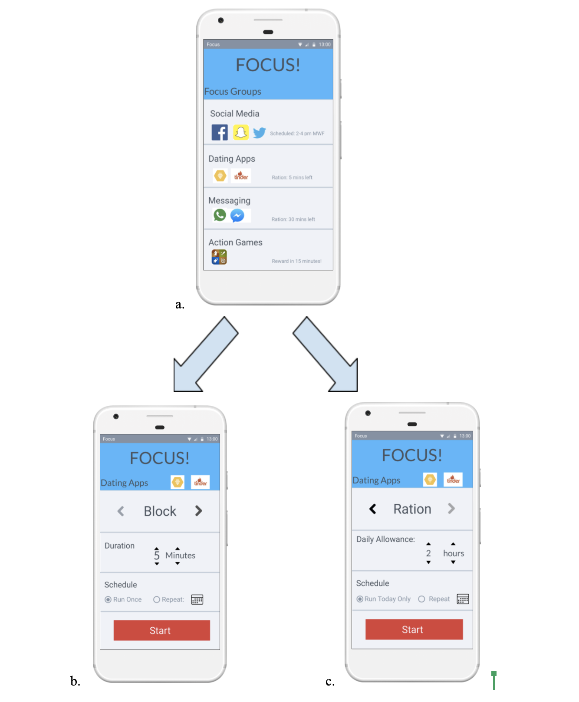

Welcome to Focus! 

Focus! is a productivity application for Android. The main functionality for this application is to block distracting apps and their notifications for a selected amount of time. Applications and their notifications can be blocked for any designated amount of time up to ten hours. Focus! also allows users to define several groups. Each group has its own list of blocked applications, and the user is able to give a custom name to each profile. Additionally, the different groups of applications can be scheduled to be blocked at recurring times.

Before you start, please ensure you are using Android API 26 and the emulator 

Please start our application and grant the two permissions that Focus! will need in order to run successfully.
        1). UsageStatsManager permission
        2). Notification permission
        
After you accept the permissions, you can use Focus! successfully. If you just accepted the Notification permission for the first time, hitting the back arrow should bring you to Focus! The next time you run Focus!, you will not have to accept these permissions anymore for they are already granted.

Start using the app to Focus!

Profiles:
 - To add profiles which you can block, you can click the pink "+" button. You can name the profile what you want to. Then, you can click on the black "+" to add apps to that profile and then click "Add Application". If you want to edit, delete, start blocking, or stop blocking a profile, you can click that profile on this page and make the desired modifications. 

Schedules:
- If you want to create a schedule, you can click on the "Schedules" tab and click on the pink "+" button. From here you can create a name for your schedule and then choose which profiles to add to it. You can then select the days to schedule the blocking followed up by the time range. From here, you can add an a schedule that will set a time that profiles can be scheduled to be blocked. You can set these schedules to repeat weekly. After a schedule has been created, you can click "Add Profile" to add more profiles. 
- You turn a schedule on or off by clicking "Turn Schedule On" or "Turn Schedule Off" depending on the current state of your schedule. 
- You can delete a schedule by clicking on the trash can icon
- Also, within "Schedules", you can can see a calendar view of when blocking happens by clicking "Calendar View".

For Testing:
- The instructions for testing our application can be find in the Assignment #4 document.
